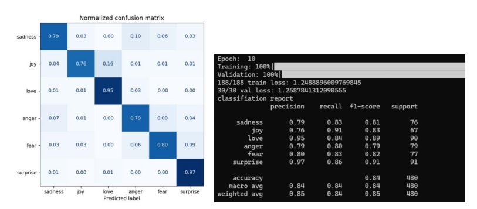

# BertMultiClassification

BERT (Bidirectional Encoder based Representation for Transformers) is an encoder base
transformer model that was developed by Googled in 2018. It was trained on approximately
2.5 billion word Wikipedia documents and 800 million word google books. Due to its
specialized training which involves bidirectional Masked Language Modeling (MLM) and
Next Sentence prediction (NSP), it performs extremely well on NLP classification problems.
MLM masks out a random word (replaces it with the [MASK] token) and the model learns to
predict the missing word. In NSP, two sentences (which may or may not be in proper order)
are fed to the model and the model learns to predict if the second sentence follows the first
or not.

We will experiment with BERT-base. It has a sequence length of 512 tokens, and an
embedding size of 768. BERT-base uses the Wordpiece tokenization algorithm which is similar to the BPE tokenization algorithm.
The dictionary for BERT comes in two flavors, cased and uncased where each character is converted to lower case.
The dictionary size for BERT-base-uncased is 30522, and for cased, it is 28997. If a word is
encountered that is not part of the dictionary, it is represented as [UNK] token.
BERT adds a special [CLS] token in the beginning of an input sequence, CLS vector
captures meaning of the entire document as it passes through different transformer layers and can be used in the classification process after the last layer.We will use BERT to experiment with multiclass classification on the emotion dataset. This dataset has six classes.

 
The DistilBERT model :

The DistilBERT model is a distilled version of BERT. It is smaller and faster, trained by
distilling BERT base. It has 40% less parameters than google-Bert/Bert-base-uncased,
executes 60% faster while preserving over 95% of BERT’s performances on most
benchmarks.
We will try DistilBert on the emotion dataset and see how it compares with the Bert-base.
To use DistilBert, the typical code for creating the tokenizer and the model is:
tokenizer = AutoTokenizer.from_pretrained('distilbert/distilbert-base-cased')
model = AutoModel.from_pretrained("distilbert/distilbert-base-cased")

Finetuning the DistilBert model for 10 epochs on the emotion dataset produces the
following result.

NLP Classification Using RoBERTa:

The RoBERTa model is an improvement over BERT. It removes the next-sentence prediction
training and is trained on much larger data (10x more data including CommonCrawl News,
OpenWebText -160GB of text), and larger mini-batches. RoBERTa has the same architecture
as BERT, but uses the BPE tokenizer instead of Wordpiece (same as GPT-2). The sequence
length is same as BERT i.e., 512.
The tokenization and model creation code for RoBERTa appears as (in Utils.py, the import
will be at the top of the file):
from transformers import RobertaTokenizer
tokenizer = RobertaTokenizer.from_pretrained("FacebookAI/roberta-base")
In MyBertModel.py, modify the model creation line as:
self.bert_model = RobertaModel.from_pretrained("FacebookAI/roberta-base")
You will need the following import for above to be recognized.
from transformers import AutoModel, RobertaModel

When we train the emotions dataset on RoBERTa for 15 epochs, the results are as shown below.

---------------------------****-------------------------------